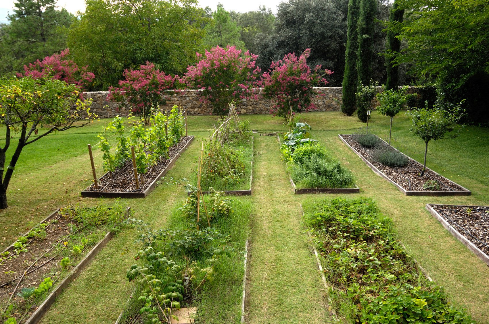
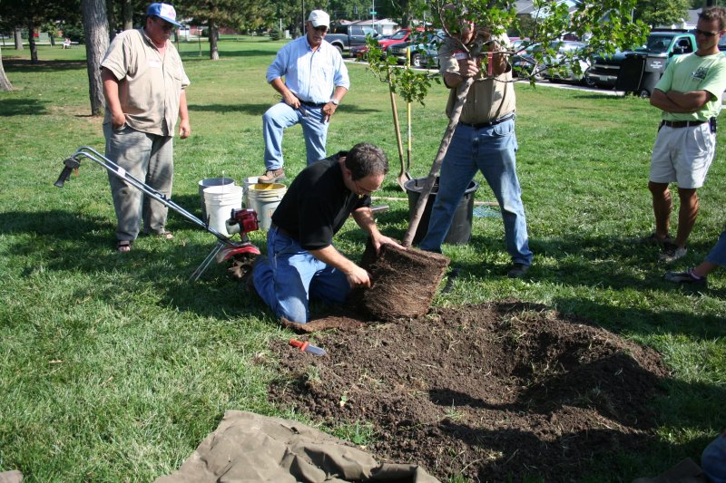
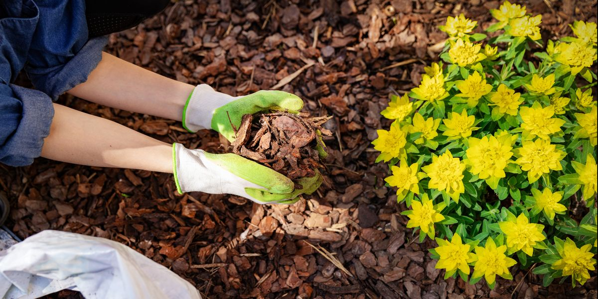
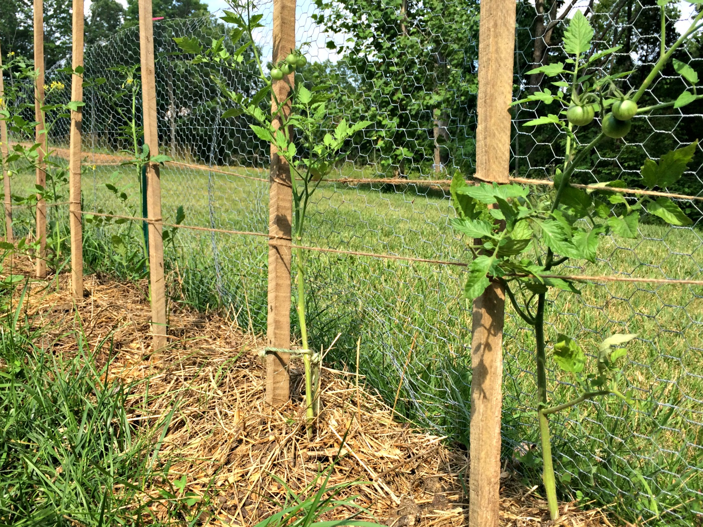
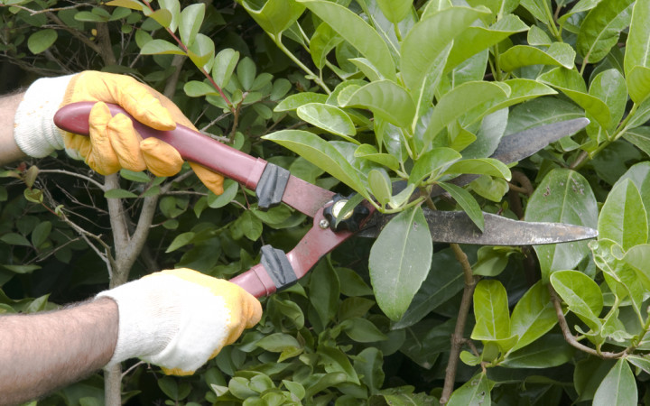
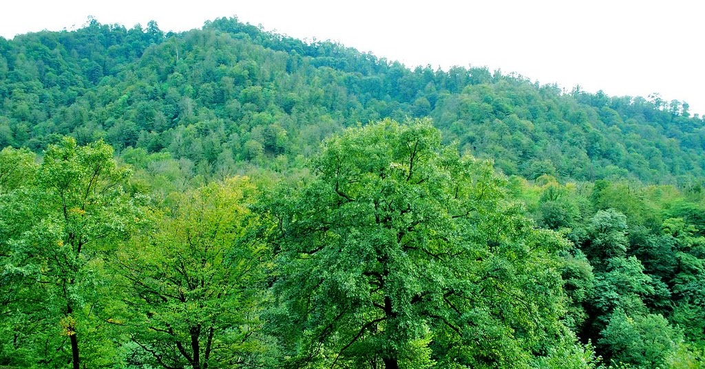
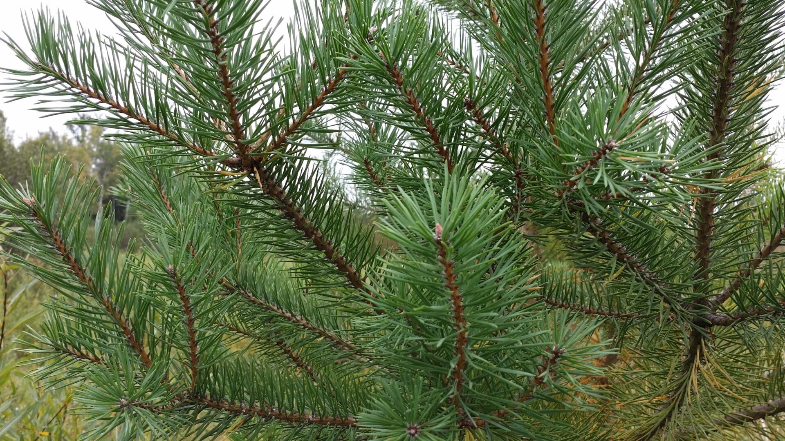
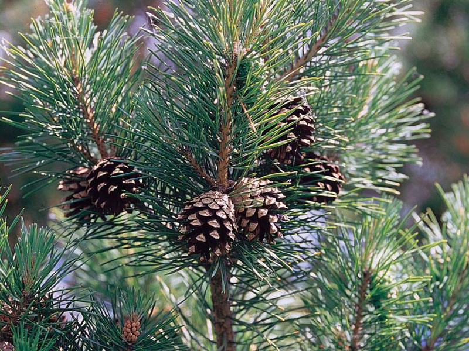

<!DOCTYPE html>
<html lang="en">
<head>
    <meta charset="UTF-8">
    <meta http-equiv="X-UA-Compatible" content="IE=edge">
    <meta name="viewport" content="width=device-width, initial-scale=1.0">
    <link rel="shortcut icon" href="assets/images/logo/icon.png" type="image/png">
    <link rel="stylesheet" href="assets/css/bootstrap.min.css">
    <link rel="stylesheet" href="https://cdnjs.cloudflare.com/ajax/libs/font-awesome/5.15.2/css/all.min.css">
    <link rel="stylesheet" href="assets/css/animate.css">
    <link rel="stylesheet" href="style.css">
    <title>TreePolice</title>
</head>
<body>
    

        <!-- start header -->
        <header class="header" id="myHeader">
            

                

                    

                        

                            
                        

                    

                    

                        <!-- nav items starts   -->
                        <nav class="navbar navbar-expand-lg nabar-own p-8">
                            <button class="navbar-toggler collapsed" type="button" data-toggle="collapse" data-target="#navbarSupportedContent" aria-controls="navbarSupportedContent" aria-expanded="false" aria-label="Toggle navigation">
                                
                                    
                                    
                                    
                                
                            </button>
                            

                                <ul class="navbar-nav mr-auto align-self-center">
                                    <li class="nav-item tr-nav-item">
                                        <a href="#Special" class="nav-link">How to Plant?</a>
                                    </li>
                                    <li class="nav-item tr-nav-item">
                                        <a href="top-gainers-leaderboard/index.html" target="_blank" class="nav-link">Leaderboards</a>
                                    </li>
                                    <li class="nav-item tr-nav-item">
                                        <a href="#feedback" class="nav-link">Partners</a>
                                    </li>
                                    <li class="nav-item tr-nav-item">
                                        <a href="#chef" class="nav-link">Team</a>
                                    </li>
                                    <li class="nav-item tr-nav-item">
                                        <a href="#contact" class="nav-link">Feedbacks</a>
                                    </li>
                                </ul>
                                

                                    <input type="text" id="search" class="form-control header-input" placeholder="Search here ...">
                                    
                                        <i class="fas fa-search"></i>
                                    
                                    <i class="fas fa-times"></i>
                                

                            

                        </nav>
                    

                

            

        </header>

        <!-- End header -->

<!-- slider section ends here -->
<section class="home-slider">
    

        
    

    

        

            

                

                    
                        Today is perfect day to plant tree
                    
                    <h1 class="wow fadeInDown" data-wow-duration="1.5s" data-wow-delay="0.4s">Our Missions</h1>
                    

                        This is a paragraph for Lorem ipsum dolor sit amet, consectetur adipisicing elit. Maxime aut, voluptas expedita quisquam sequi dignissimos dicta officia, nemo illo itaque adipisci. Tempora ut ab nam! Quidem voluptatum rerum quaerat obcaecati.
                    

                

                

                    

                        <button class="btn"><a href="https://teamtrees.org" target="_blank">Plant Now</a></button>
                    

                    

                        

                            
                        

                        
Watch Our Story
 

                        <!-- modal section starts  -->
                        

                            

                                

                                    <button type="button" data-dismiss="modal" aria-label="Close" class="close">
                                        <i class="fas fa-window-close"></i>
                                    </button>
                                    

                                        <video controls width="727" height="600">
                                            <source src="assets/videos/video5357459677233813701.mp4" type="video/mp4">
                                        </video>
                                    

                                

                            

                        

                        <!-- modal section ends -->
                    

                

            

        

    

</section>

<!-- Our specialities items starts  -->

<section class="specialities position-relative" id="Special">
    <h2 class="d-none">hidden</h2>
    

        
    

    

        

            

                

                    <h2 class="mb-0">Tree Planting Guide SELECTING A TREE</h2>
                

                

                    Please make sure the tree you plant is suited to your climate zone
                    and will survive the local soil and weather. 
                    Call a local plant nursery and ask them to recommend a hearty native species. Ask the nursery 
                    staff to tell you if the tree likes full sun or shade or has any other special requirements. 

            

        

        

            

                

                    
                

            

            

            

                

                    <h3 class="mb-0">CHOOSE LOCATION</h3>
                

                

                    • Depending on if your tree likes full sun or partial shade, 
                    choose an area that provides it with the light it needs. 
                    • Avoid planting under telephone wires or near solar panels 
                    that your tree may grow to shade. 
                    • Choose a location where the tree can easily receive water 
                    on a regular basis.                

            

        

        

            

                

                    <h3 class="mb-0">PLANT </h3>
                

                

                    • Dig a hole. Your hole needs to be big enough for the 
                    roots to sit fully inside. 
                    • Gently spread out the roots. If you see any damaged or 
                    twisted roots, cut them off. 
                    • Set the tree in the hole to see how it fits. The collar/root flare 
                    should be just at soil level or a little above. 
                    • Fill in dirt. Do not add anything to the dirt like mulch, peat moss, 
                    or fertilizer. 
                    • Build a circular dirt dam around the outer edge of your tree 
                    planting area to retain water. 
                    • Stomp dirt around the root ball firmly. This should create a small 
                    depression into which water can settle.                 

            

            

            

                

                    
                

            

        

        
        

            

                

                    
                

            

            

            

                

                    <h3 class="mb-0">WATER</h3>
                

                

                    • Water the tree immediately after planting. This is critical 
                    for its survival. 
                    • Avoid stepping on the wet soil around the tree. 
                    • Water the tree regularly until established. Let the root zone dry 
                    out between waterings. 
                    • Do not water if temperatures approach or drop below freezing.                

            

        

        

            

                

                    <h3 class="mb-0">MULCH </h3>
                

                

                    • Choose a mulch that is dry and has not been exposed to potentially 
                    harmful contaminants. 
                    • Mulch the surface of the soil around your newly planted trees two 
                    to four inches deep. 
                    • Do not pile the mulch up against the trunk—leave space for the 
                    trunk to breathe.                 

            

            

            

                

                    
                

            

        

        

            

                

                    
                

            

            

            

                

                    <h3 class="mb-0">STAKE (IF NECESSARY)</h3>
                

                

                    • Only stake newly planted trees if they are too weak to stand on 
                    their own. Remove stakes as soon as tree is established. 
                    • Use one or two wooden stakes and pound them firmly into the 
                    soil 6-12 inches from the tree trunk. 
                    • Anchor to tree. Rope, wire, or cable should never be placed 
                    directly on tree stems or branches—use material with a broad, 
                    smooth surface. 
                    • Suitable materials to wrap around the tree stem include wide 
                    canvas strapping, strips of old carpeting, bicycle inner tube, and 
                    burlap.                

            

        

        

            

                

                    <h3 class="mb-0">PRUNE</h3>
                

                

                    • You will not need to prune your tree for a year after you plant. 
                    • You may trim broken or rubbing branches, but do not remove more 
                    than 1/5 of the branches.  
                    • After the first year, if there are shoots growing up from the bottom 
                    of the tree, trim these “suckers” back to the base. 
                    • Do not prune the top of the tree! 
                    • For fruit trees, seek out professional guidance from an arborist or 
                    handbook.                 

            

            

            

                

                    
                

            

        

        

            

                

                    
                

            

            

            

                

                    <h3 class="mb-0">CARE AFTER PLANTING</h3>
                

                

                    • Young trees benefit if they are irrigated, fertilized, and weeded. 
                    • Water them according to nursery instructions. 
                    • If trees do not grow well and arenot a healthy green color, 
                    fertilize—but donot overdo it!              

            

        

    

</section>

<!-- Our specialities items ends  -->

<section id="menu" class="our-item-section position-relative">
    <h2 class="d-none">hidden</h2>
    

        
    

    

        

            

                

                    <h2 class="mb-0">Tree Species</h2>
                

                
Lorem ipsum dolor sit amet consectetur adipisicing elit. Exercitationem, inventore cumque eum sapiente officiis recusandae totam repudiandae voluptate corporis tenetur, voluptatem voluptas ratione voluptatibus ullam.

            

        

        

            

                <ul data-wow-duration="2s" data-wow-delay="0.4s" class="our-item-tab nav-tabs nav flex-column pl-0 wow fadeIn">
                    <li class="nav-item">
                        <a href="#veg" data-toggle="tab" class="nav-link active">Leaves</a>
                    </li>
                    <li class="nav-item">
                        <a href="#nonveg" data-toggle="tab" class="nav-link">Location</a>
                    </li>
                    <li class="nav-item">
                        <a href="#mushroom" data-toggle="tab" class="nav-link">Species</a>
                    </li>
                    <li class="nav-item">
                        <a href="#cheese" data-toggle="tab" class="nav-link">Bush</a>
                    </li>
                  
                </ul>
            

            

            

                

                    

                        

                            

                                

                                    

                                        <h3 class="mb-0">Broad-leaved trees</h3>
                                    

                                    

                                        

                                            Lorem ipsum, dolor sit amet consectetur adipisicing elit. Quae, voluptate eaque. Saepe dolor incidunt vero iusto eum. Tempore, accusantium unde?
                                        

                                        

                                            <button class="btn">Plant Now</button>
                                        

                                    

                                    

                                        
                                        
                                    

                                

                            

                            

                                

                                    

                                        <h3 class="mb-0">Coniferous Trees</h3>
                                    

                                    

                                        

                                            Lorem ipsum, dolor sit amet consectetur adipisicing elit. Quae, voluptate eaque. Saepe dolor incidunt vero iusto eum. Tempore, accusantium unde?
                                        

                                        

                                            <button class="btn">Plant Now</button>
                                        

                                    

                                    

                                        
                                        
                                    

                                

                            

                        

                    

                    

                        

                            

                                

                                    
                                    
                                    
                                

                            

                                

                                

                                    

                                        <h3 class="mb-0">Azerbaijan</h3>
                                    

                                    

                                        

                                            Lorem ipsum, dolor sit amet consectetur adipisicing elit. Quae, voluptate eaque. Saepe dolor incidunt vero iusto eum. Tempore, accusantium unde?
                                        

                                        

                                            <button class="btn">Plant Now</button>
                                        

                                    

                                    

                                        
                                        
                                    

                                

                            

                        

                    

                    

                        

                            

                                

                                    

                                        <h3 class="mb-0">Pine tree</h3>
                                    

                                    

                                        

                                            Lorem ipsum, dolor sit amet consectetur adipisicing elit. Quae, voluptate eaque. Saepe dolor incidunt vero iusto eum. Tempore, accusantium unde?
                                        

                                        

                                            <button class="btn">Plant Now</button>
                                        

                                    

                                    
                                

                                

                                
 
                                    

                                    

                                        <h3 class="mb-0">Pine tree</h3>
                                    

                                    

                                        

                                            Lorem ipsum, dolor sit amet consectetur adipisicing elit. Quae, voluptate eaque. Saepe dolor incidunt vero iusto eum. Tempore, accusantium unde?
                                        

                                        

                                            <button class="btn">Plant Now</button>
                                        

                                    

                                    

                                        
                                        
                                    

                                

                            

                        

                    

                    

                        

                            

                                

                                    

                                        <h3 class="mb-0">Bushes</h3>
                                    

                                    

                                        

                                            Lorem ipsum, dolor sit amet consectetur adipisicing elit. Quae, voluptate eaque. Saepe dolor incidunt vero iusto eum. Tempore, accusantium unde?
                                        

                                        

                                            <button class="btn">Plant Now</button>
                                        

                                    

                                    

                                        
                                    

                                

                                

                                

                                

                                    

                                        <h3 class="mb-0">Bushes 2</h3>
                                    

                                    

                                        

                                            Lorem ipsum, dolor sit amet consectetur adipisicing elit. Quae, voluptate eaque. Saepe dolor incidunt vero iusto eum. Tempore, accusantium unde?
                                        

                                        

                                            <button class="btn">Plant Now</button>
                                        

                                    

                                    

                                        
                                    

                                

                            

                        

                    

                

            

        

    

</section>
 

<!-- testimonial section  -->
<section class="testimonials position-relative" id="feedback">
    <h2 class="d-none">hidden</h2>
    

        
    

    

        

            

                

                    <h2 class="mb-0">Our Partners </h2>
                

                

                    Lorem ipsum dolor, sit amet consectetur adipisicing elit. Nemo voluptatibus praesentium mollitia non ut inventore in exercitationem id doloremque voluptate.
                

            

        

        

            

                

                    

                        
                        
                        
                    

                    

                        
                        
                        
                    

                    

                        
                        
                        
                        
                        
                        
                    

                

            

            

                <ul class="slider testimonials-slider wow fadeInwow fadeIn" data-wow-duration="2s" data-wow-delay="0.4s">
                    <li class="slide-item">
                        

                            
                        

                        

                            
Lorem ipsum, dolor sit amet consectetur adipisicing elit. Ex debitis nobis esse at obcaecati recusandae nam laboriosam enim id officiis.

                            
Lorem ipsum dolor sit amet consectetur adipisicing elit. Veritatis officia eaque earum excepturi expedita et porro incidunt deserunt, veniam fugit?

                            <h3 class="mb-0">Ministry of Education of Azerbaijan</h3>
                            Main Partner
                        

                    </li>
                    <li class="slide-item">
                        

                            
                        

                        

                            
Lorem ipsum, dolor sit amet consectetur adipisicing elit. Ex debitis nobis esse at obcaecati recusandae nam laboriosam enim id officiis.

                            
Lorem ipsum dolor sit amet consectetur adipisicing elit. Veritatis officia eaque earum excepturi expedita et porro incidunt deserunt, veniam fugit?

                            <h3 class="mb-0">The Coca-Cola Company</h3>
                            Partner
                        

                    </li>
                    <li class="slide-item">
                        

                            
                        

                        

                            
Lorem ipsum, dolor sit amet consectetur adipisicing elit. Ex debitis nobis esse at obcaecati recusandae nam laboriosam enim id officiis.

                            
Lorem ipsum dolor sit amet consectetur adipisicing elit. Veritatis officia eaque earum excepturi expedita et porro incidunt deserunt, veniam fugit?

                            <h3 class="mb-0">Ministry of Youth and Sports of Azerbaijan Republic</h3>
                            Main Partner
                        

                    </li>
                    <li class="slide-item">
                        

                            
                        

                        

                            
Lorem ipsum, dolor sit amet consectetur adipisicing elit. Ex debitis nobis esse at obcaecati recusandae nam laboriosam enim id officiis.

                            
Lorem ipsum dolor sit amet consectetur adipisicing elit. Veritatis officia eaque earum excepturi expedita et porro incidunt deserunt, veniam fugit?

                            <h3 class="mb-0">Ministry of Ecology and Natural Resources </h3>
                            Main Partner
                        

                    </li>
                    <li class="slide-item">
                        

                            
                        

                        

                            
Lorem ipsum, dolor sit amet consectetur adipisicing elit. Ex debitis nobis esse at obcaecati recusandae nam laboriosam enim id officiis.

                            
Lorem ipsum dolor sit amet consectetur adipisicing elit. Veritatis officia eaque earum excepturi expedita et porro incidunt deserunt, veniam fugit?

                            <h3 class="mb-0">The Coca-Cola Company</h3>
                            Partner
                        

                    </li>
                    <li class="slide-item">
                        

                            
                        

                        

                            
Lorem ipsum, dolor sit amet consectetur adipisicing elit. Ex debitis nobis esse at obcaecati recusandae nam laboriosam enim id officiis.

                            
Lorem ipsum dolor sit amet consectetur adipisicing elit. Veritatis officia eaque earum excepturi expedita et porro incidunt deserunt, veniam fugit?

                            <h3 class="mb-0">The Coca-Cola Company</h3>
                            Partner
                        

                    </li>
                </ul>
            

        

    

</section>

<!-- team section  -->
<section class="chef-section position-relative" id="chef">
    <h2 class="d-none">hidden</h2>
    

        
    

    

        

            

                

                    <h2 class="mb-0">TreePolice Team</h2>
                

                

                    Lorem ipsum dolor, sit amet consectetur adipisicing elit. Nemo voluptatibus praesentium mollitia non ut inventore in exercitationem id doloremque voluptate.
                

            

        

        

            

                

                    

                        

                            
                        

                    

                    

                    

                        

                            <h3 class="mb-0">Iltun Huseynli</h3>
                            

                                Lorem ipsum, dolor sit amet consectetur adipisicing elit. Voluptatum ad harum temporibus numquam est praesentium repellat accusamus exercitationem repellendus sapiente, pariatur quod sunt maiores nostrum amet possimus vitae ullam fugiat.
                            

                            
Team Leader and Analyst

                            ADA University, BSCS 2024
                            

                                <a href="#" class="fb-ic"><i class="fab fa-facebook-f mr-4"></i></a>
                                <a href="#" class="tw-ic"><i class="fab fa-twitter mr-4"></i></a>
                                <a href="#" class="ins-ic"><i class="fab fa-instagram mr-4"></i></a>
                                <a href="#" class="pin-ic"><i class="fab fa-pinterest mr-4"></i></a>
                                <a href="#" class="sn-ic"><i class="fab fa-snapchat mr-4"></i></a>
                            

                        

                    

                

            

            

                

                    

                        

                            
                        

                    

                    

                    

                        

                            <h3 class="mb-0">Karam Afandi</h3>
                            

                                Lorem ipsum, dolor sit amet consectetur adipisicing elit. Voluptatum ad harum temporibus numquam est praesentium repellat accusamus exercitationem repellendus sapiente, pariatur quod sunt maiores nostrum amet possimus vitae ullam fugiat.
                            

                            
Web Developer and Graphic Designer

                            ADA University, BSCS 2024
                            

                                <a href="#" class="fb-ic"><i class="fab fa-facebook-f mr-4"></i></a>
                                <a href="#" class="tw-ic"><i class="fab fa-twitter mr-4"></i></a>
                                <a href="#" class="ins-ic"><i class="fab fa-instagram mr-4"></i></a>
                                <a href="#" class="pin-ic"><i class="fab fa-pinterest mr-4"></i></a>
                                <a href="#" class="sn-ic"><i class="fab fa-snapchat mr-4"></i></a>
                            

                        

                    

                

            

            

                

                    

                        

                            
                        

                    

                    

                    

                        

                            <h3 class="mb-0">Abdulrahman Mammadli</h3>
                            

                                Lorem ipsum, dolor sit amet consectetur adipisicing elit. Voluptatum ad harum temporibus numquam est praesentium repellat accusamus exercitationem repellendus sapiente, pariatur quod sunt maiores nostrum amet possimus vitae ullam fugiat.
                            

                            
Project Manager

                            ADA University, BSE 2024
                            

                                <a href="#" class="fb-ic"><i class="fab fa-facebook-f mr-4"></i></a>
                                <a href="#" class="tw-ic"><i class="fab fa-twitter mr-4"></i></a>
                                <a href="#" class="ins-ic"><i class="fab fa-instagram mr-4"></i></a>
                                <a href="#" class="pin-ic"><i class="fab fa-pinterest mr-4"></i></a>
                                <a href="#" class="sn-ic"><i class="fab fa-snapchat mr-4"></i></a>
                            

                        

                    

                

            

        

    

</section>

<!-- email section  -->
<section class="email-subscription position-relative" id="contact">
    

        

            

                

                    <h2 class="mb-0">Want to get the latest update?</h2>
                

                

                    Lorem ipsum dolor, sit amet consectetur adipisicing elit. Nemo voluptatibus praesentium mollitia non ut inventore in exercitationem id doloremque voluptate.
                

            

        

        

            

                <form action="#" class="email-form">
                    

                        <input type="email" class="form-control" placeholder="Your Emai Id">
                        <button type="submit" class="btn btn-primary email-form-button">SEND</button>
                    

                </form>
            

        

    

</section>

    

    <!-- footer section  -->
    <footer class="position-relative wow fadeIn" data-wow-duration="2s" data-wow-delay="0.4s">
        

            

                

                    

                        

                            <ul>
                                <li class="nav-item">
                                    <a href="#Special" class="nav-link">How to plant</a>
                                </li>
                                <li class="nav-item">
                                    <a href="#menu" class="nav-link">Tree Species</a>
                                </li>
                                <li class="nav-item">
                                    <a href="#feedback" class="nav-link">Partners</a>
                                </li>
                                <li class="nav-item">
                                    <a href="#chef" class="nav-link">Team</a>
                                </li>
                                <li class="nav-item">
                                    <a href="#contact" class="nav-link">Contact</a>
                                </li>
                            </ul>
                        

                    

                

                

                    

                        

                            
                        

                    

                

                

                    

                        <a href="#" class="fb-ic">
                            <i class="fab fa-facebook-f mr-2 mr-md-5 wow fadeInDown" data-wow-duration="1.5s" data-wow-delay="0.4s"></i>
                        </a>
                        <a href="#" class="tw-ic">
                            <i class="fab fa-twitter mr-2 mr-md-5 wow fadeInUp" data-wow-duration="1.5s" data-wow-delay="0.4s"></i>
                        </a>
                        <a href="#" class="ins-ic">
                            <i class="fab fa-instagram mr-2 mr-md-5 wow fadeInDown" data-wow-duration="1.5s" data-wow-delay="0.4s"></i>
                        </a>
                        <a href="#" class="pin-ic">
                            <i class="fab fa-pinterest mr-2 mr-md-5 wow fadeInUp" data-wow-duration="1.5s" data-wow-delay="0.4s"></i>
                        </a>
                        <a href="#" class="sn-ic">
                            <i class="fab fa-snapchat mr-2 mr-md-5 wow fadeInDown" data-wow-duration="1.5s" data-wow-delay="0.4s"></i>
                        </a>
                    

                

            

        

    </footer>
<!--  FOOTER SECTION START-->

  <!--  FOOTER SECTION END-->
    
    
    
    
    
    
    

    
</body>
</html>
